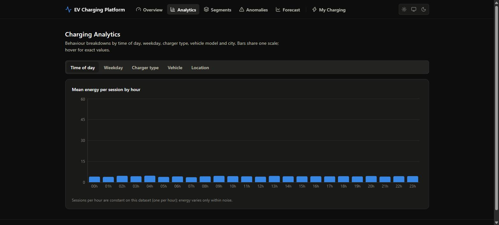
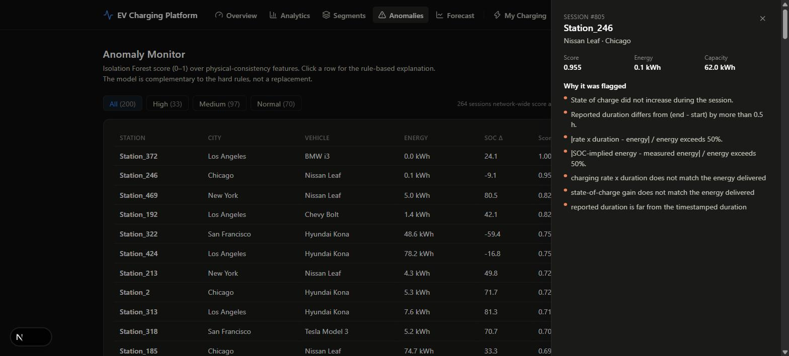
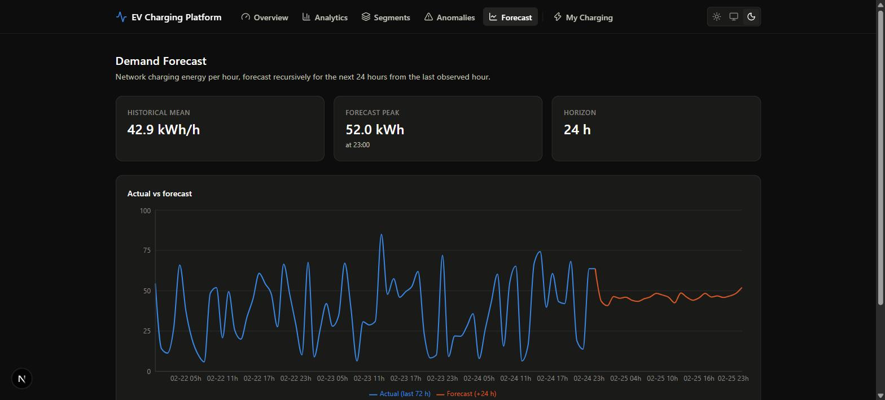
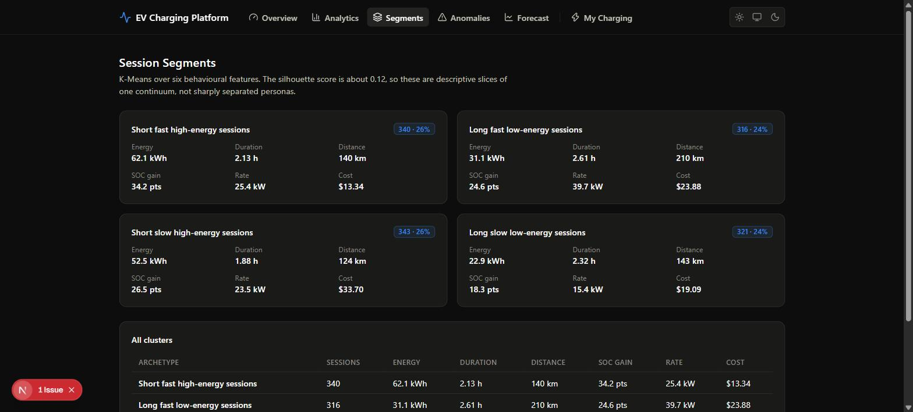
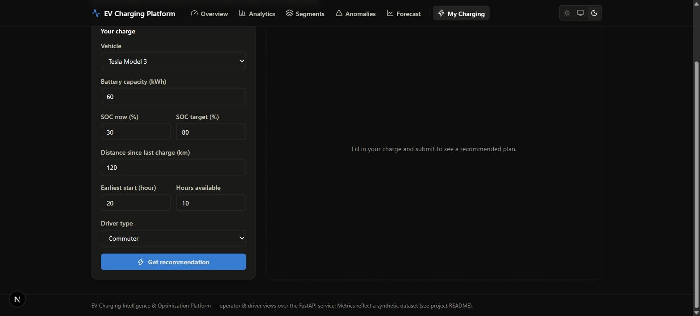

# EV Charging Intelligence & Optimization Platform

An end-to-end machine-learning system that validates and analyzes EV charging sessions,
predicts session energy and duration, segments charging behavior, flags anomalous
sessions with domain-rule explanations, forecasts network charging demand, and turns
those models into charging recommendations.

**Stack:** Python · pandas · scikit-learn · XGBoost · SHAP · joblib · FastAPI · Next.js ·
Tailwind · Recharts · pytest

> **Status:** all six phases complete — data pipeline, five models, recommendation
> engine, analytics layer, FastAPI service, Next.js dashboard, and packaging (Docker
> Compose, CI, MLflow). The dataset is synthetic; see the honesty note below.

---

## What this project is

The platform answers one question end to end:

> *What is happening across EV charging infrastructure, why is it happening, what will
> happen next, and what should the operator or driver do about it?*

Rather than a folder of disconnected notebooks, it is a single system where analytics →
supervised ML → unsupervised ML → forecasting → anomaly detection → recommendations all
operate on the same validated feature table.

| Module | Question | Approach |
| --- | --- | --- |
| **A · Analytics** | What does the network look like? | KPIs + time/location/segment breakdowns, precomputed to `analytics.json` |
| **B · Energy prediction** | How much energy will this session need? | Regression (baseline → linear → RF → XGBoost) |
| **C · Duration prediction** | How long will it take? | Regression, same lineup |
| **D · Session segmentation** | What kinds of charging sessions exist? | `StandardScaler` → K-Means, elbow + silhouette |
| **E · Anomaly detection** | Which sessions are physically implausible? | Domain rules + Isolation Forest, reconciled |
| **F · Demand forecasting** | What will network demand be next? | Hourly aggregation, lag features, walk-forward |
| **G · Recommendation** | What should the driver do? | Charging physics + the models above |

---

## Dashboard

| | |
|---|---|
|  |  |
| **Overview** — network KPIs, data-quality summary, service status | **Analytics** — tabbed time / weekday / charger / vehicle / city breakdowns |
|  |  |
| **Anomalies** — sortable score table with a rule-based reason drawer | **Forecast** — 72 h actual vs 24 h recursive forecast |
|  |  |
| **Segments** — K-Means archetype profiles | **My Charging** — driver form → recommended plan + charger comparison |

---

## The data, and an honesty note

The single source is `data/raw/ev_charging_patterns.csv` — **1,320 charging sessions**,
20 columns, spanning **2024-01-01 to 2024-02-24**, across 462 stations and 5 US cities.
It is a **synthetic dataset published for practising ML workflows**, and it was generated
column by column with very little cross-column consistency. Exploration surfaced three
facts that shape every design decision:

1. **1,320 rows = 1,320 unique users.** Exactly one session per user, so behavioural
   analysis is done at the **session** level, not the user level.
2. **The timestamps are a perfect 55 × 24 hourly grid** — one session every hour, no
   gaps. The *number* of sessions per hour never changes, so demand forecasting targets
   **energy per hour**, not session count. Per-station forecasting (~2.8 sessions each)
   is too sparse and is not attempted.
3. **The physics does not hold.** Reported charging duration disagrees with the
   timestamps on ~72% of rows; `rate × duration` disagrees with energy on ~59%; energy
   exceeds battery capacity on 190 rows; state of charge falls during a charge on 268.
   About **98% of rows break at least one validation rule.**

The project treats this as the point, not a problem. It **measures** the damage with a
nine-rule validation layer instead of silently "fixing" numbers, and it reports model
quality against simple baselines. On this data:

- **The energy and duration regressors do not beat a mean baseline** — the targets are
  uncorrelated with every feature (all |r| < 0.05). This is stated plainly in the
  notebooks; the recommendation engine is built on charging physics instead.
- **Session clusters are soft** (silhouette ≈ 0.12) and are presented as a descriptive
  lens, not discovered personas.
- **Demand has no trend or seasonality**; the forecaster beats a seasonal-naive baseline
  but not a flat mean.

The value of the project is the **pipeline, the validation, and the honest evaluation** —
all of which would surface real signal on a real dataset.

---

## Results

Metrics are 5-fold cross-validated (regression) or walk-forward (forecasting) and live in
`models/metrics.json`.

### Energy regressor — target `energy_kwh` (kWh), 1,254 rows

| Model | MAE | RMSE | R² |
| --- | --- | --- | --- |
| **Mean baseline** | **19.08** | **22.40** | **−0.00** |
| Linear regression | 19.33 | 22.69 | −0.03 |
| Random forest | 19.37 | 22.94 | −0.05 |
| XGBoost | 20.18 | 24.27 | −0.18 |

### Duration regressor — target `duration_hours` (hours), 1,320 rows

| Model | MAE | RMSE | R² |
| --- | --- | --- | --- |
| **Mean baseline** | **0.87** | **1.01** | **−0.00** |
| Linear regression | 0.88 | 1.02 | −0.03 |
| Random forest | 0.89 | 1.03 | −0.04 |
| XGBoost | 0.92 | 1.08 | −0.14 |

*No learned model beats the mean — see the honesty note above.*

### Session segmentation — K-Means, k = 4, silhouette 0.12

| Archetype | Sessions |
| --- | --- |
| Short fast high-energy sessions | 340 |
| Short slow high-energy sessions | 343 |
| Long fast low-energy sessions | 316 |
| Long slow low-energy sessions | 321 |

### Anomaly detection — Isolation Forest vs 5 hard validation rules

| Metric | Value |
| --- | --- |
| Sessions flagged by the model (top 20%) | 264 |
| Sessions breaking a hard rule | 441 |
| Precision vs hard rules | 0.47 |
| Recall vs hard rules | 0.28 |

The model catches rare, extreme violations (out-of-range capacity, SOC outside 0–100) at
high rates and common ones (SOC not increasing) at the base rate — rules and ML are
**complementary**, and the platform ships both plus a reason string per session.

### Demand forecasting — network `energy_kwh` per hour, walk-forward MAE

| Forecast | MAE (kWh) |
| --- | --- |
| Seasonal-naive (value 24 h ago) | 25.19 |
| Gradient boosting | 19.58 |
| Flat historical mean | 18.71 |

---

## Repository layout

```
ev/
├── data/
│   ├── raw/ev_charging_patterns.csv     the source data (committed)
│   ├── processed/                        sessions_clean.parquet, validation_report.json,
│   │                                     analytics.json  (git-ignored, regenerated)
│   └── README.md                         column dictionary + known issues
├── notebooks/
│   ├── 01_eda.ipynb                      full EDA: validation, physics checks, analysis
│   ├── 02_feature_engineering.ipynb      the feature build, step by step
│   ├── 03_energy_prediction.ipynb        Module B
│   ├── 04_duration_prediction.ipynb      Module C
│   ├── 05_session_segmentation.ipynb     Module D
│   ├── 06_anomaly_detection.ipynb        Module E
│   ├── 07_demand_forecasting.ipynb       Module F
│   ├── 08_recommendation_engine.ipynb    Module G
│   └── 09_operator_analytics.ipynb       Module A — the precomputed dashboard payload
├── src/evcharging/
│   ├── config.py                         paths, column names, validation thresholds
│   ├── data/          load.py            read + clean + type + true duration
│   │                  validate.py        9 domain rules → flags + validation_report.json
│   ├── features/      build.py           calendar parts, consistency ratios, encodings
│   ├── models/        regression.py      shared 4-model regression suite
│   │                  energy.py, duration.py, segmentation.py, anomaly.py, demand.py
│   │                  common.py          metrics, K-fold, artifact + metrics IO
│   ├── recommendation/ strategy.py       physics estimators, recommend(), compare_chargers()
│   └── analytics/     aggregate.py       overview/patterns/locations/segments/anomalies → JSON
├── scripts/
│   ├── prepare_data.py                   raw CSV → processed parquet + report
│   ├── train_all.py                      train all five models + write analytics.json
│   └── build_analytics.py                (re)build data/processed/analytics.json only
├── api/                                  FastAPI service (Phase 4)
│   ├── app.py         create_app()      CORS, exception handlers, startup artifact load
│   ├── state.py       AppState          loads models + analytics + derived anomaly table
│   ├── routes.py      APIRouter         all 10 endpoints
│   ├── schemas.py     pydantic v2       request/response models
│   ├── tests/                           TestClient coverage for every endpoint
│   ├── Dockerfile                       self-contained image (trains at build time)
│   └── README.md
├── web/                                  Next.js + Tailwind + Recharts dashboard (Phase 5)
│   ├── app/           overview · analytics · segments · anomalies · forecast · my-charging
│   ├── components/    app shell, theme toggle, charts, ui/ primitives
│   ├── lib/           api.ts (typed client) · types.ts
│   ├── Dockerfile     standalone build
│   └── README.md
├── models/                               *.joblib, metrics.json, SHAP plots (git-ignored)
├── tests/                                69 pytest tests (54 core + 15 API)
├── docs/screenshots/                     dashboard screenshots (used in this README)
├── .github/workflows/ci.yml              ruff + eslint + pytest + train-from-scratch smoke test
├── docker-compose.yml, Makefile
├── pyproject.toml, requirements.txt, .dockerignore
└── STYLE_GUIDE.md, CODE_STYLE.md, PLAN.md
```

---

## Quickstart

Everything in containers (needs Docker only):

```bash
docker compose up --build      # API → :8000/docs   ·   dashboard → :3000
```

The API image regenerates the dataset and trains all five models at build time, so the
first build takes a few minutes and then the stack is self-contained.

## Local setup

Requires **Python 3.10+** and **Node 20+**.

```bash
python -m venv .venv && . .venv/bin/activate     # .venv\Scripts\activate on Windows
pip install -e ".[dev,api,viz]"                  # or: pip install -r requirements.txt
# make setup does the two lines above
```

`requirements.txt` covers the full stack (modelling, notebooks, tests, API). The
`evcharging` package itself only needs pandas / numpy / scikit-learn / xgboost / joblib;
`matplotlib` / `seaborn` / `shap` are for the notebooks, `fastapi` / `uvicorn` for the API.

## Run it

A `Makefile` wraps the common tasks (`make help` lists them):

```bash
make pipeline        # prepare_data → train_all → analytics.json   (models/ + data/processed/)
make test lint       # pytest (core + API)  ·  ruff + web eslint
make api             # uvicorn api.app:app       → http://localhost:8000/docs
make web             # next dev (needs the API)  → http://localhost:3000
```

Or the underlying commands:

```bash
python scripts/prepare_data.py          # → data/processed/sessions_clean.parquet + validation_report.json
python scripts/train_all.py             # → models/*.joblib + metrics.json + analytics.json
python scripts/train_all.py --track     # ...and log runs to MLflow (sqlite:///mlflow.db)
python scripts/build_analytics.py       # rebuild analytics.json only
jupyter lab notebooks/                  # the 10 notebooks, each re-showing every step
uvicorn api.app:app --reload            # the API
cd web && npm install && npm run dev    # the dashboard
```

Quick recommendation-engine check:

```python
from evcharging.recommendation import RecommendationRequest, recommend
from evcharging.recommendation.strategy import load_context

ctx = load_context()
req = RecommendationRequest(
    vehicle_model="Tesla Model 3", battery_capacity_kwh=60,
    soc_start_pct=30, soc_target_pct=80, distance_km=120,
    earliest_hour=20, hours_available=10,
)
print(recommend(req, **{k: ctx[k] for k in ("demand_by_hour", "segmenter_bundle", "energy_model")}).as_dict())
```

---

## How the pieces fit

```
                     raw CSV
                        │
         evcharging.data.load  ──►  clean, typed, true duration
                        │
     evcharging.data.validate  ──►  9 rule flags + validation_report.json
                        │
   evcharging.features.build   ──►  calendar · consistency ratios · encodings
                        │
              sessions_clean.parquet   (1,320 × 57)
                        │
        ┌───────────────┼─────────────────┬───────────────┬──────────────┐
        ▼               ▼                 ▼               ▼              ▼
  energy / duration   segmentation     anomaly         demand      analytics
   regressors         (K-Means)     (IsolationForest) (walk-forward)  aggregate
        │               │                 │               │              │
        │               │                 │               │              ▼
        │               │                 │               │        analytics.json
        │               │                 │               │      (dashboard payload)
        └───────────────┴────────┬────────┴───────────────┘
                                 ▼
                 evcharging.recommendation.strategy
              (charging physics + models + demand curve)
                                 │
        ┌────────────────────────┴───────────────────────┐
        ▼                                                ▼
  charger · window · energy · cost · reason      analytics.json
        │                                                │
        └──────────────────────┬─────────────────────────┘
                               ▼
                    api/  (FastAPI service)
      /health · /analytics/* · /anomalies · /forecast
           /predict/energy · /predict/duration · /recommend
                               │
                               ▼
                    web/  (Next.js dashboard)
       Overview · Analytics · Segments · Anomalies · Forecast · My Charging
```

---

## API

```bash
pip install -e ".[api]"
uvicorn api.app:app --reload        # http://localhost:8000/docs
# or:  docker build -f api/Dockerfile -t evcharging-api . && docker run -p 8000:8000 evcharging-api
```

The service loads the five `.joblib` models and `analytics.json` once at startup. If
they are missing it still boots — `/health` and `/docs` work, data routes return 503 with
the fix. Analytics routes serve the precomputed payload unchanged (no pandas per
request). `/predict/*` responses include a `note` that no model beats the mean baseline
on this data. Full endpoint table and configuration: [`api/README.md`](api/README.md).

---

## Dashboard

```bash
cd web
cp .env.example .env.local        # NEXT_PUBLIC_API_BASE_URL → the API
npm install && npm run dev        # http://localhost:3000  (API must be running)
# or:  docker build -f web/Dockerfile -t evcharging-web . && docker run -p 3000:3000 evcharging-web
```

Next.js App Router + Tailwind v4 + Recharts. **Operator** views — Overview (KPIs),
Analytics (time/weekday/charger/vehicle/city breakdowns), Segments, Anomalies (sortable
table + reason drawer), Forecast (actual vs forecast). **Driver** view — `/my-charging`
form → recommendation card. Theme-aware; charts use the validated project palette; if the
API is down each page shows an inline "couldn't load" card. Details:
[`web/README.md`](web/README.md).

---

## Roadmap

- [x] **Phase 1** — data loading, validation, feature engineering, EDA
- [x] **Phase 2** — energy, duration, segmentation, anomaly, demand models
- [x] **Phase 3** — recommendation engine + analytics aggregation layer
- [x] **Phase 4** — FastAPI service (`/analytics/*`, `/anomalies`, `/forecast`,
      `/predict/*`, `/recommend`), pydantic v2 schemas, CORS, `TestClient` tests, Dockerfile
- [x] **Phase 5** — Next.js dashboard: operator views (Overview, Analytics, Segments,
      Anomalies, Forecast) + driver view (My Charging), theme-aware, typed API client
- [x] **Phase 6** — `docker-compose.yml`, per-service Dockerfiles, `Makefile`,
      GitHub Actions CI (ruff + eslint + pytest + a train-from-scratch smoke test),
      MLflow logging behind `train_all.py --track`

---

## Deployment

Not deployed. When it is:

- **`web/`** → Vercel. Set `NEXT_PUBLIC_API_BASE_URL` to the public API URL at build time;
  the dashboard's server components also read `INTERNAL_API_BASE_URL` when set.
- **`api/`** → any container host (Fly.io, Render, a VM). Build `api/Dockerfile`, set
  `EVCHARGING_CORS_ORIGINS` to the dashboard's origin. The image is stateless — models
  are baked in at build time; retrain by rebuilding.
- CI (`.github/workflows/ci.yml`) already runs lint + tests + the full offline pipeline
  on every push, so a deploy step is a small addition.

---

## License / data

The dataset is synthetic and included for demonstration only; it is not a reliable source
for research or publication. See `data/README.md` for the column dictionary and the full
list of known data-quality issues.
