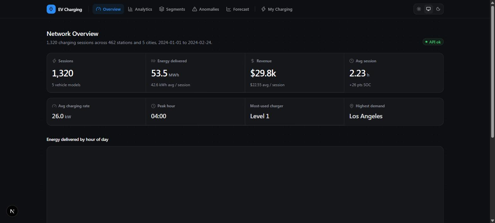
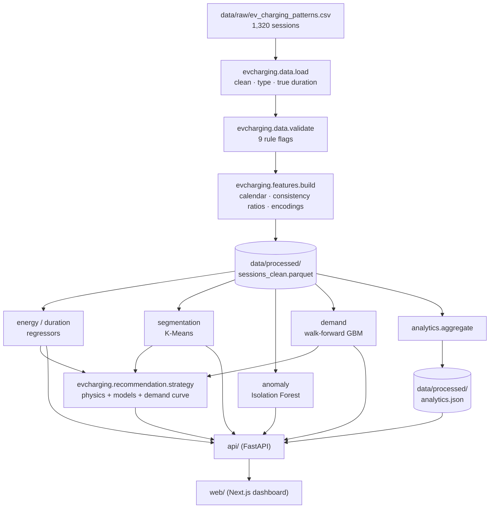
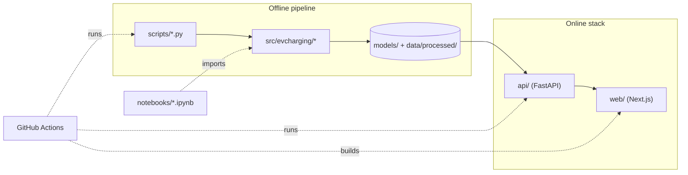
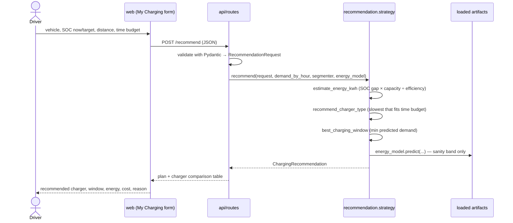
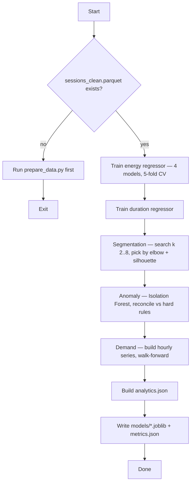

# EV Charging Intelligence & Optimization Platform

An end-to-end machine-learning system that validates EV charging sessions, predicts
session energy and duration, segments charging behaviour, flags physically implausible
sessions, forecasts network demand, and turns those models into charging recommendations
— served through a FastAPI backend and a Next.js dashboard.

## Description

Electric-vehicle charging networks generate a stream of session records (who charged,
where, for how long, how much energy). Operators want to know **what is happening, why,
what happens next, and what to do about it**; drivers want to know **which charger to use
and when**. This project answers all of that from one validated dataset:

- **What it does** — cleans and validates raw session data, then runs five ML models
  (two regressors, a clustering model, an anomaly detector, a demand forecaster) and a
  rule-plus-physics recommendation engine on top of it.
- **The problem it solves** — turning messy, inconsistent session logs into decisions:
  demand planning, anomaly triage, and per-driver charging advice.
- **Why it was built** — as a portfolio-grade example of a *complete* ML system: data
  engineering → statistics → supervised & unsupervised ML → forecasting → a decision
  layer → an API → a UI → tests → CI → containers.
- **The main outcome** — a working operator dashboard and driver tool, plus an honest
  evaluation. The dataset is synthetic and, as the analysis shows, has almost no
  learnable signal; the deliverable is the **pipeline and the rigour**, not the accuracy
  numbers. See [Reading the results](#16-reading-the-results).

## Badges

[](https://github.com/srummanf/EV-Charging-Intelligence-Optimization-Platform/actions/workflows/ci.yml)


> No `LICENSE` file is committed yet, so no license badge is shown.

## Result



The platform ships as a running stack — an API on `:8000` and a dashboard on `:3000`
with six views (screenshots in [`docs/screenshots/`](docs/screenshots)). The models are
trained, evaluated against baselines, and persisted; every number below is reproducible
with `python scripts/train_all.py`.

| Model | Metric | Result | Baseline it is measured against |
| --- | --- | --- | --- |
| Energy regressor | MAE (kWh), 5-fold CV | 19.08 | mean baseline 19.08 — **not beaten** |
| Duration regressor | MAE (hours), 5-fold CV | 0.87 | mean baseline 0.87 — **not beaten** |
| Session segmentation | silhouette | 0.12 | soft clusters, `k = 4` |
| Anomaly detection | precision / recall vs hard rules | 0.47 / 0.28 | complementary to the rules |
| Demand forecast | MAE (kWh/hour), walk-forward | 19.58 | seasonal-naive 25.19, flat mean 18.71 |

Full tables and interpretation: [Results](#17-results) and
[Reading the results](#16-reading-the-results).

## Where to start

**Read in this order.**

| # | Document | For |
| - | --- | --- |
| 1 | [`docs/SETUP.md`](docs/SETUP.md) | Install everything and verify it works |
| 2 | [`docs/WALKTHROUGH.md`](docs/WALKTHROUGH.md) | Run every script and test, step by step, with expected output |
| 3 | [`docs/STRUCTURE.md`](docs/STRUCTURE.md) | What every folder and file does |
| 4 | [`docs/spec/architecture.md`](docs/spec/architecture.md) | System design, data flow, module responsibilities |
| 5 | [`docs/results/FINDINGS.md`](docs/results/FINDINGS.md) | Why the metrics look the way they do, and what to take from them |
| 6 | [`docs/BRIEF.md`](docs/BRIEF.md) | The original project brief, annotated with what shipped |
| 7 | [`notebooks/`](notebooks) `01` → `09` | The worked analysis — each notebook teaches its technique |

> The rest of this README is the summary: concepts, architecture, setup, the end-to-end
> run, every script, the results, the API reference, and how to extend the project.

## Table of Contents

1. [What problem this solves](#1-what-problem-this-solves)
2. [Concepts you need (read this first)](#2-concepts-you-need-read-this-first)
3. [How the whole thing fits together](#3-how-the-whole-thing-fits-together)
4. [Tech stack](#4-tech-stack)
5. [Features](#5-features)
6. [Architecture](#6-architecture)
7. [UML diagrams](#7-uml-diagrams)
8. [Repository map](#8-repository-map)
9. [The data model](#9-the-data-model)
10. [Requirements](#10-requirements)
11. [Setup](#11-setup)
12. [Run it end to end](#12-run-it-end-to-end)
13. [Every script, explained](#13-every-script-explained)
14. [Demo](#14-demo)
15. [API reference](#15-api-reference)
16. [Reading the results](#16-reading-the-results)
17. [Results](#17-results)
18. [Continuous integration](#18-continuous-integration)
19. [Build steps](#19-build-steps)
20. [Roadmap](#20-roadmap)
21. [Lessons learned](#21-lessons-learned)
22. [Troubleshooting](#22-troubleshooting)
23. [Extending the project](#23-extending-the-project)
24. [Glossary](#24-glossary)
25. [Documentation](#25-documentation)

---

## 1. What problem this solves

A charging network produces one row per session. On their own those rows do not tell an
operator whether tomorrow evening will be busy, which sessions are broken meter readings,
or what a driver should do differently. This project builds the layer that turns rows
into answers, structured as seven modules that all read the same validated feature table:

| Module | Question it answers | Approach |
| --- | --- | --- |
| **A · Analytics** | What does the network look like right now? | KPIs + time / location / segment breakdowns, precomputed to `analytics.json` |
| **B · Energy prediction** | How much energy will this session need? | Regression: mean baseline → linear → random forest → XGBoost |
| **C · Duration prediction** | How long will it take? | Regression, same line-up |
| **D · Session segmentation** | What *kinds* of charging sessions exist? | `StandardScaler` → K-Means, `k` chosen by elbow + silhouette |
| **E · Anomaly detection** | Which sessions are physically implausible? | Domain rules + Isolation Forest, reconciled against each other |
| **F · Demand forecasting** | What will network demand be next? | Hourly aggregation, lag features, walk-forward validation |
| **G · Recommendation** | What should the driver do? | Charging physics + the models above + the demand curve |

The honest finding (see [Reading the results](#16-reading-the-results)) is that the
supplied dataset is synthetic and its columns were generated independently, so the
predictive models cannot beat trivial baselines. The project's value is the **method** —
validate, baseline, cross-validate, report the gap — which would surface real structure
on real data.

## 2. Concepts you need (read this first)

You do not need an ML background. These are the ideas the project uses:

- **Charging session** — one visit to a charger: start/end time, energy delivered (kWh),
  battery state of charge (SOC, %) before and after, cost, location, vehicle.
- **Feature engineering** — turning raw columns into model inputs: e.g. splitting a
  timestamp into "hour" and "is it a weekend", or combining columns into a ratio that
  should equal 1 if the physics is consistent.
- **Regression** — predicting a number (energy, duration). Judged by how far predictions
  land from the truth: **MAE** (average miss) and **RMSE** (average miss, penalising big
  misses), and **R²** (fraction of variance explained; 0 = "no better than the average",
  negative = "worse than the average").
- **Baseline** — the simplest possible predictor (always guess the average). A model is
  only useful if it beats the baseline. This project always reports both.
- **Cross-validation** — instead of one train/test split, rotate through 5 folds so every
  row is tested once; the score is the average. Less luck-dependent.
- **Clustering (K-Means)** — grouping similar sessions with no labels. **Silhouette** (−1
  to 1) measures how well-separated the groups are; ~0 means they overlap.
- **Anomaly detection (Isolation Forest)** — an unsupervised model that scores how
  "unusual" each row is, without being told what an anomaly looks like.
- **Time-series forecasting & walk-forward validation** — predicting future values from
  past ones; you must train only on the past, then step forward — never shuffle time.
- **Charging physics** — two identities that should hold for a real session:
  `energy ≈ rate × duration` and `SOC gain ≈ energy / battery capacity × 100`. The
  project checks both and uses them in the recommendation engine.

More terms are in the [Glossary](#24-glossary).

## 3. How the whole thing fits together

One dataset flows through a data layer, into five models and an analytics aggregator,
into a decision layer, then out through an API to a dashboard.



The offline half (raw → parquet → models → `analytics.json`) is run once by
`scripts/train_all.py`; the online half (API → dashboard) reads the artifacts it
produced.

## 4. Tech stack

| Area | Technology | Purpose |
| --- | --- | --- |
| Language | Python 3.10+ | data pipeline, models, API |
| Data | pandas, NumPy, PyArrow (Parquet) | loading, feature engineering, storage |
| ML | scikit-learn, XGBoost | regressors, K-Means, Isolation Forest, gradient boosting |
| Explainability | SHAP | feature-attribution plots for the tree models |
| Persistence | joblib | model artifacts (`models/*.joblib`) |
| Experiment tracking | MLflow *(optional)* | `train_all.py --track` logs runs to `sqlite:///mlflow.db` |
| Backend | FastAPI, Uvicorn, Pydantic v2 | REST API over the models and analytics payload |
| Frontend | Next.js (App Router), React 19, TypeScript | operator & driver dashboard |
| Styling / charts | Tailwind CSS v4, Recharts, lucide-react, next-themes | theme-aware UI and charts |
| Notebooks | Jupyter | the 9 worked analysis notebooks |
| Testing | pytest, FastAPI `TestClient`, ESLint | 69 Python tests + web lint |
| Lint / format | Ruff | Python lint + format |
| CI | GitHub Actions | lint, train-from-scratch smoke test, tests, web build |
| Containers | Docker, Docker Compose | one-command full stack |

## 5. Features

- **Nine-rule data validation** — every session is checked against charging physics and
  plausible ranges; violations become boolean flags and a `validation_report.json`.
- **Reproducible feature pipeline** — one function (`build_features`) produces the
  57-column `sessions_clean.parquet` that every model reads.
- **Five models, each baselined and cross-validated** — energy, duration, segmentation,
  anomaly, demand. Results written to a single `models/metrics.json`.
- **Rule + ML anomaly detection** — a continuous `anomaly_score` in `[0, 1]` plus a
  plain-language reason string per session, reconciled against the hard rules.
- **Physics-based recommendation engine** — pure, unit-tested functions that estimate
  energy / duration / cost, pick the slowest charger that fits the time budget, and pick
  the quietest hour to start.
- **FastAPI service** — 10 endpoints; loads artifacts once at startup; degrades to
  `503` with a helpful message if artifacts are missing.
- **Operator + driver dashboard** — KPI overview, tabbed analytics, cluster profiles, a
  sortable anomaly table with a reason drawer, an actual-vs-forecast chart, and a
  "My Charging" form. Theme-aware; shows an inline error card if the API is down.
- **One-command everything** — `make pipeline`, `make test lint`, `docker compose up`.
- **CI on every push** — Ruff + ESLint + a full train-from-scratch run + pytest + web build.

## 6. Architecture

Full design doc with data models and diagrams:
[`docs/spec/architecture.md`](docs/spec/architecture.md). In brief:

**Two halves.** The *offline* half is a batch pipeline that produces artifacts; the
*online* half serves those artifacts. They share nothing at runtime except the files in
`models/` and `data/processed/`.

**Offline (`scripts/`, `src/evcharging/`)**

| Component | Responsibility |
| --- | --- |
| `evcharging.data.load` | Read the CSV, fix the mojibake `Temperature (°C)` header, parse timestamps, compute the *true* duration from `end − start`. |
| `evcharging.data.validate` | Nine domain rules → per-row `flag_*` booleans + `validation_report.json`. |
| `evcharging.features.build` | Calendar parts, SOC/energy/power consistency ratios, one-hot + ordinal encodings → `sessions_clean.parquet`. |
| `evcharging.models.*` | `regression` (shared 4-model suite) + `energy`, `duration`, `segmentation`, `anomaly`, `demand`; each persists a `.joblib` and a `metrics.json` section. |
| `evcharging.recommendation.strategy` | Pure estimator functions + `recommend()` / `compare_chargers()`. |
| `evcharging.analytics.aggregate` | `overview` / `patterns` / `locations` / `segments` / `anomalies` → `analytics.json`. |

**Online (`api/`, `web/`)**

| Component | Responsibility |
| --- | --- |
| `api.state.AppState` | Loads the 5 models + `analytics.json` + `metrics.json` once at startup; derives a per-session anomaly table and an hourly demand series. |
| `api.routes` | 10 endpoints on one router; thin handlers that call into `evcharging`. |
| `api.app` | `create_app()`: CORS (`EVCHARGING_CORS_ORIGINS`), `ValueError → 422`, missing-artifacts → `503`, startup lifespan. |
| `web/lib/api.ts` | Typed client. Browser uses `NEXT_PUBLIC_API_BASE_URL`; server-side rendering uses `INTERNAL_API_BASE_URL` when set (Docker Compose). |
| `web/app/*` | Six pages; data pages are dynamic Server Components, interactive pages (`anomalies`, `forecast`, `my-charging`) hydrate as Client Components. |

**External dependencies at runtime:** none. No third-party APIs, no external database —
everything is local files. MLflow (optional) writes to a local SQLite file.

## 7. UML diagrams

**Component diagram**



**Sequence — a `POST /recommend` request**



**Activity — the offline pipeline (`scripts/train_all.py`)**



## 8. Repository map

```
ev/
├── data/
│   ├── raw/ev_charging_patterns.csv     the source data (committed)
│   ├── processed/                        parquet + JSON, git-ignored, regenerated
│   └── README.md                         column dictionary + known issues
├── notebooks/                            01_eda … 09_operator_analytics
├── src/evcharging/
│   ├── config.py                         paths, column names, validation thresholds
│   ├── data/            load.py · validate.py
│   ├── features/        build.py
│   ├── models/          regression.py · energy · duration · segmentation · anomaly · demand · common
│   ├── recommendation/  strategy.py
│   └── analytics/       aggregate.py
├── scripts/             prepare_data.py · train_all.py · build_analytics.py
├── api/                 FastAPI service — app.py · state.py · routes.py · schemas.py · tests/ · Dockerfile · README.md
├── web/                 Next.js dashboard — app/ · components/ · lib/ · Dockerfile · README.md
├── models/              *.joblib · metrics.json · SHAP plots  (git-ignored)
├── tests/               69 pytest tests (54 core + 15 API)
├── docs/screenshots/    dashboard screenshots used in this README
├── .github/workflows/ci.yml
├── docker-compose.yml · Makefile
├── pyproject.toml · requirements.txt · .dockerignore
└── PLAN.md · STYLE_GUIDE.md · CODE_STYLE.md
```

**Every folder and file explained:** [`docs/STRUCTURE.md`](docs/STRUCTURE.md).
Per-directory detail also lives in `data/README.md`, `api/README.md`, `web/README.md`.

## 9. The data model

### Raw input — `data/raw/ev_charging_patterns.csv`

**1,320 sessions, 20 columns**, 2024-01-01 to 2024-02-24, 462 stations, 5 US cities.
Synthetic; **not** valid for research. Key columns (full dictionary in
[`data/README.md`](data/README.md)):

| Column (raw) | Meaning | Notes |
| --- | --- | --- |
| `User ID` | one per row | ⇒ one session per user; behaviour analysis is session-level |
| `Vehicle Model` | 5 models | Tesla Model 3, Hyundai Kona, Nissan Leaf, BMW i3, Chevy Bolt |
| `Battery Capacity (kWh)` | pack size | contains implausible values (1.5–193) |
| `Charging Start/End Time` | timestamps | form a perfect 55 × 24 hourly grid |
| `Energy Consumed (kWh)` | delivered energy | 66 missing; 190 rows exceed battery capacity |
| `Charging Duration (hours)` | reported duration | disagrees with `End − Start` on ~72% of rows |
| `Charging Rate (kW)` | average power | 66 missing |
| `State of Charge (Start/End %)` | battery % | 32 rows outside 0–100; 268 rows do not increase |
| `Distance Driven (…) (km)` | since last charge | 66 missing |
| `Temperature (°C)` | ambient | header contains a Latin-1 byte; fixed on load |
| `Charger Type` | Level 1 / Level 2 / DC Fast Charger | |
| `User Type` | Commuter / Casual Driver / Long-Distance Traveler | |

### Processed output — `data/processed/sessions_clean.parquet`

All 1,320 rows, **57 columns**, git-ignored, regenerated by `prepare_data.py`:

- **canonical names** — `energy_kwh`, `soc_start_pct`, `start_time`, … (see
  `src/evcharging/config.py`)
- **`duration_hours`** — the trustworthy duration, from `end_time − start_time`
- **engineered features** — `hour`, `weekday`, `is_weekend`, `soc_delta_pct`,
  `power_consistency_ratio`, `soc_energy_consistency_ratio`, one-hot vehicle/location/
  user-type columns, `charger_type_code`
- **validation flags** — 9 `flag_*` booleans + `flag_any`

Missing values are **left as `NaN`**; each model drops rows on its own target and imputes
predictors on its own subset.

### Precomputed payload — `data/processed/analytics.json`

`overview`, `patterns`, `locations`, `segments`, `anomalies` — the exact shapes the
dashboard renders, so no pandas runs per request.

## 10. Requirements

| Requirement | Version / note |
| --- | --- |
| Python | 3.10+ (CI uses 3.12) |
| Node.js | 20+ (CI uses 22) — only for the dashboard |
| Docker + Docker Compose | optional, for the one-command stack |
| Disk | ~1 GB for Python deps; ~2 GB more for the two container images |
| Environment variables | all optional — sensible defaults everywhere (see [Setup](#11-setup)) |
| External services / API keys | **none** |

## 11. Setup

Detailed version with every gotcha (Jupyter kernel, `import evcharging`, `.env`,
Windows line endings): [`docs/SETUP.md`](docs/SETUP.md).

### Option A — Docker (nothing but Docker needed)

```bash
docker compose up --build      # API → http://localhost:8000/docs   ·   dashboard → http://localhost:3000
```

The API image regenerates the dataset and trains all five models at build time, so the
first build takes a few minutes; after that the stack is self-contained.

### Option B — local

```bash
git clone https://github.com/srummanf/EV-Charging-Intelligence-Optimization-Platform.git
cd EV-Charging-Intelligence-Optimization-Platform

python -m venv .venv
source .venv/bin/activate                 # Windows: .venv\Scripts\activate
pip install -e ".[dev,api,viz]"           # or: pip install -r requirements.txt
# `make setup` runs the venv + install for you

cd web && npm install && cd ..            # only if you want the dashboard
```

`pyproject.toml` optional extras: `viz` (matplotlib/seaborn/shap, for notebooks),
`api` (fastapi/uvicorn/httpx), `dev` (pytest/ruff/jupyter), `tracking` (mlflow).

### Environment variables

| Variable | Used by | Default |
| --- | --- | --- |
| `EVCHARGING_CORS_ORIGINS` | API | `http://localhost:3000,http://127.0.0.1:3000` |
| `NEXT_PUBLIC_API_BASE_URL` | dashboard (browser) | `http://localhost:8000` |
| `INTERNAL_API_BASE_URL` | dashboard (server-side render) | falls back to the public URL |
| `MLFLOW_TRACKING_URI` | `train_all.py --track` | `sqlite:///mlflow.db` |

For local dev the defaults work. To override, create `web/.env.local` with
`NEXT_PUBLIC_API_BASE_URL=...`.

## 12. Run it end to end

The same steps with the **expected output of every command**:
[`docs/WALKTHROUGH.md`](docs/WALKTHROUGH.md).

```bash
# 1. build the processed dataset  →  data/processed/
python scripts/prepare_data.py

# 2. train + evaluate + persist all five models, and write analytics.json  →  models/
python scripts/train_all.py
#    add --track to also log runs to MLflow (sqlite:///mlflow.db)

# 3. (optional) rebuild only the dashboard payload
python scripts/build_analytics.py

# 4. serve it
uvicorn api.app:app --reload              # http://localhost:8000/docs
cd web && npm run dev                     # http://localhost:3000  (API must be running)

# 5. check everything
pytest                                    # 69 tests
ruff check .                              # Python lint
cd web && npm run lint && npm run build   # web lint + production build
```

`make` shortcuts: `make pipeline` (steps 1–2; `train_all.py` also writes `analytics.json`),
`make api`, `make web`, `make test`, `make lint`. Run `make help` for the full list.

### Quick recommendation check (no API needed)

```python
from evcharging.recommendation import RecommendationRequest, recommend
from evcharging.recommendation.strategy import load_context

ctx = load_context()
req = RecommendationRequest(
    vehicle_model="Tesla Model 3", battery_capacity_kwh=60,
    soc_start_pct=30, soc_target_pct=80, distance_km=120,
    earliest_hour=20, hours_available=10,
)
print(recommend(req, **{k: ctx[k] for k in ("demand_by_hour", "segmenter_bundle", "energy_model")}).as_dict())
```

## 13. Every script, explained

| Script | Input | Output | What it does |
| --- | --- | --- | --- |
| `scripts/prepare_data.py` | `data/raw/ev_charging_patterns.csv` | `data/processed/sessions_clean.parquet`, `validation_report.json` | Loads and cleans the CSV, builds all features, adds the 9 validation flags, prints the rule-violation summary, writes the parquet. |
| `scripts/train_all.py` | `sessions_clean.parquet` | `models/*.joblib`, `models/metrics.json`, `analytics.json`, SHAP PNGs | Trains and cross-validates each model, picks the best per task, persists artifacts, refreshes the analytics payload. `--track` logs to MLflow. |
| `scripts/build_analytics.py` | `sessions_clean.parquet` (+ segmenter & anomaly artifacts if present) | `data/processed/analytics.json` | Rebuilds just the dashboard payload — faster than a full `train_all` when only the aggregation changed. |

All three add `src/` to `sys.path` themselves, so they run from the repo root without
`pip install -e .`.

## 14. Demo

- **Dashboard** — `docker compose up --build`, then open <http://localhost:3000>. Six
  pages: Overview, Analytics, Segments, Anomalies, Forecast, My Charging.
  Screenshots in [`docs/screenshots/`](docs/screenshots).
- **API docs** — <http://localhost:8000/docs> (interactive Swagger UI).
- **Notebooks** — `jupyter lab notebooks/` and open `01_eda.ipynb`; each notebook runs
  top-to-bottom and explains its technique.
- **One API call:**
  ```bash
  curl -s -X POST http://localhost:8000/recommend \
    -H 'content-type: application/json' \
    -d '{"vehicle_model":"Nissan Leaf","battery_capacity_kwh":40,"soc_start_pct":35,"soc_target_pct":90,"earliest_hour":20,"hours_available":10}'
  ```

No hosted demo is deployed — see [Roadmap](#20-roadmap).

## 15. API reference

**Base URL (local):** `http://localhost:8000` — full interactive reference at `/docs`.
**Auth:** none. **CORS:** controlled by `EVCHARGING_CORS_ORIGINS`.

| Method | Path | Purpose |
| --- | --- | --- |
| `GET` | `/health` | liveness + which artifacts loaded |
| `GET` | `/analytics/overview` | KPI row (sessions, energy, cost, peak hour, data quality) |
| `GET` | `/analytics/patterns` | breakdowns by hour, weekday, charger type, vehicle |
| `GET` | `/analytics/locations` | per-city table |
| `GET` | `/analytics/segments` | K-Means cluster profiles + archetype names |
| `GET` | `/anomalies` | ranked anomalous sessions — `?limit=`, `?min_score=`, `?risk=high\|medium\|normal` |
| `GET` | `/forecast` | recursive hourly demand forecast + recent history — `?hours=` (1–168) |
| `POST` | `/predict/energy` | energy regressor (kWh) for a pre-session request |
| `POST` | `/predict/duration` | duration regressor (hours) |
| `POST` | `/recommend` | full charging plan: charger, window, energy/time/cost, reason, options |

If the model artifacts are missing the service still starts; `/health` and `/docs` work
and the data routes return `503` telling you to run `scripts/train_all.py`. `/predict/*`
responses carry a `note` that no model beats the mean baseline on this data. Details and
request/response schemas: [`api/README.md`](api/README.md).

## 16. Reading the results

Deep dive: [`docs/results/FINDINGS.md`](docs/results/FINDINGS.md). Summary below.

The numbers are deliberately unimpressive, and that is the point. The dataset is
synthetic and generated **column by column**, so cross-column relationships that a real
network would have are absent:

1. **The timestamps are a perfect 55 × 24 hourly grid** — exactly one session per hour.
   Session count has zero variance, so demand forecasting targets **energy per hour**,
   not session count.
2. **The physics does not hold** — reported duration disagrees with `End − Start` on
   ~72% of rows, `rate × duration` disagrees with energy on ~59%, energy exceeds battery
   capacity on 190 rows, SOC falls during a charge on 268. **~98% of rows break at least
   one validation rule.**
3. **The targets are uncorrelated with every feature** (`|r| < 0.05`), so the energy and
   duration regressors **cannot beat a mean baseline** — every learned model scores a
   slightly negative cross-validated R².

How to read each model:

- **Regressors** — compare the model MAE to the mean-baseline MAE in the same row. Here
  they are equal, so the shipped "model" is effectively the population mean, and the
  recommendation engine uses **charging physics** instead.
- **Segmentation** — silhouette ≈ 0.12 means the four archetypes are *descriptive slices*
  of one continuous cloud, not distinct personas. Useful as a lens, not a claim.
- **Anomaly detection** — precision 0.47 / recall 0.28 against the hard rules is *good*:
  the model is meant to catch rare oddities the rules miss, not reproduce the rules. It
  scores rare violations (out-of-range capacity, SOC) highly and common ones at the base
  rate.
- **Demand forecast** — beating seasonal-naive (25.19) but not the flat mean (18.71)
  confirms there is no trend or seasonality to exploit; the model learns the mean.

On a real dataset the same pipeline — validate, baseline, cross-validate, report the gap
— would surface whatever signal exists.

## 17. Results

5-fold cross-validated (regression), walk-forward (forecasting). Regenerate with
`python scripts/train_all.py`; the source of truth is `models/metrics.json`. Full
per-model tables (all folds, all baselines):
[`docs/results/BENCHMARK_RESULTS.md`](docs/results/BENCHMARK_RESULTS.md).

### Energy regressor — target `energy_kwh` (kWh), 1,254 rows

| Model | MAE | RMSE | R² |
| --- | --- | --- | --- |
| **Mean baseline** | **19.08** | **22.40** | **−0.00** |
| Linear regression | 19.33 | 22.69 | −0.03 |
| Random forest | 19.37 | 22.94 | −0.05 |
| XGBoost | 20.18 | 24.27 | −0.18 |

### Duration regressor — target `duration_hours` (hours), 1,320 rows

| Model | MAE | RMSE | R² |
| --- | --- | --- | --- |
| **Mean baseline** | **0.87** | **1.01** | **−0.00** |
| Linear regression | 0.88 | 1.02 | −0.03 |
| Random forest | 0.89 | 1.03 | −0.04 |
| XGBoost | 0.92 | 1.08 | −0.14 |

*No learned model beats the mean — see [Reading the results](#16-reading-the-results).*

### Session segmentation — K-Means, `k = 4`, silhouette 0.12

| Archetype | Sessions |
| --- | --- |
| Short fast high-energy sessions | 340 |
| Short slow high-energy sessions | 343 |
| Long fast low-energy sessions | 316 |
| Long slow low-energy sessions | 321 |

### Anomaly detection — Isolation Forest vs 5 hard validation rules

| Metric | Value |
| --- | --- |
| Sessions flagged by the model (top ~20%) | 264 |
| Sessions breaking a hard rule | 441 |
| Precision vs hard rules | 0.47 |
| Recall vs hard rules | 0.28 |

### Demand forecasting — network `energy_kwh` per hour, walk-forward MAE

| Forecast | MAE (kWh) |
| --- | --- |
| Seasonal-naive (value 24 h ago) | 25.19 |
| Gradient boosting | 19.58 |
| Flat historical mean | 18.71 |

## 18. Continuous integration

`.github/workflows/ci.yml` runs on every push to `main` and every pull request. Two jobs:

- **python** — `ruff check .` → `prepare_data.py` + `train_all.py` + `build_analytics.py`
  (a full **train-from-scratch smoke test**) → `pytest -q` (all 69 tests, including the
  API tests, which need the freshly trained artifacts).
- **web** — `npm ci` → `npm run lint` → `npm run build`.

A green CI run therefore proves the whole offline pipeline still works and the dashboard
still compiles. There is no separate "release gate" and nothing is auto-deployed.

## 19. Build steps

The project was built in **6 phases**. The plan is [`PLAN.md`](PLAN.md); the phase-by-
phase log with the reasoning behind each choice is
[`docs/spec/BUILD_LOG.md`](docs/spec/BUILD_LOG.md); the original brief, annotated with
what shipped, is [`docs/BRIEF.md`](docs/BRIEF.md).

| Phase | Delivered |
| --- | --- |
| 1 · Foundation | `evcharging.data` + `evcharging.features`, `prepare_data.py`, EDA + feature notebooks |
| 2 · Models | energy, duration, segmentation, anomaly, demand; `train_all.py`; notebooks 03–07 |
| 3 · Recommendation | `recommendation.strategy`, `analytics.aggregate`; notebooks 08–09 |
| 4 · API | FastAPI service, Pydantic schemas, `TestClient` tests, Dockerfile |
| 5 · Dashboard | Next.js operator + driver views, typed API client, theme support |
| 6 · Packaging | `docker-compose.yml`, per-service Dockerfiles, `Makefile`, GitHub Actions CI, MLflow `--track` |

## 20. Roadmap

**Known gap**

- `.dockerignore` currently excludes `web/`, which breaks `docker compose build` for the
  web service from a clean clone. A one-line fix is staged locally and needs to be
  committed.

**Possible future improvements**

- Deploy: `web/` → Vercel, `api/` → a container host; add a deploy step to CI.
- Swap the synthetic CSV for a real charging dataset and re-run the pipeline unchanged —
  the interesting part is whether the models then beat their baselines.
- Add authentication / rate limiting to the API before any public deployment.
- Add a `LICENSE` file.
- Widen web test coverage (currently lint + build only).

Nothing here is a committed plan; `PLAN.md` phases 1–6 are all done.

## 21. Lessons learned

- **Baselines are non-negotiable.** Reporting "MAE 19 kWh" alone would look like a
  working model. Reporting it next to a mean baseline of 19 kWh tells the truth. Every
  model here is measured against the simplest possible predictor.
- **Validate before you model.** The nine-rule validation layer turned "the models are
  bad" into "the data has no cross-column signal, and here is the measurement" — a far
  more useful conclusion, and the basis of the anomaly module.
- **Let the data pick the design.** One session per user ⇒ session-level (not user-level)
  segmentation. A perfect hourly grid ⇒ forecast energy, not session count. 2.8 sessions
  per station ⇒ no per-station model.
- **A decision layer does not have to be ML.** When the regressors failed to beat
  baselines, the recommendation engine fell back to charging physics — pure, testable
  functions — with the ML output kept only as a sanity band.
- **Precompute for the serving path.** The API never runs pandas per request; it reads
  `analytics.json` and artifacts loaded once at startup, and degrades gracefully when
  they are missing.
- **Keep the offline and online halves decoupled.** They share only files, so the
  notebooks, the training scripts, the API, and CI can all evolve independently.

## 22. Troubleshooting

| Symptom | Cause / fix |
| --- | --- |
| API routes return `503` "missing model artifacts" | Run `python scripts/prepare_data.py` then `python scripts/train_all.py`. `/health` and `/docs` still work. |
| `scripts/train_all.py` says `sessions_clean.parquet not found` | Run `python scripts/prepare_data.py` first. |
| Dashboard pages show "Couldn't load this data" | The API is not running or `NEXT_PUBLIC_API_BASE_URL` is wrong. Start `uvicorn api.app:app`. |
| `docker compose build` fails on `web` with `"/web": not found` | The committed `.dockerignore` excludes `web/`; apply the staged one-line fix (see [Roadmap](#20-roadmap)). |
| `import evcharging` fails in a notebook or REPL | The notebooks add `../src` to `sys.path`; for a REPL run `pip install -e .` or set `PYTHONPATH=src`. |
| `train_all.py --track` errors about the MLflow file store | Recent MLflow deprecated the bare-directory store; the script defaults to `sqlite:///mlflow.db`. Set `MLFLOW_TRACKING_URI` to override. |
| Jupyter uses a different Python than your venv | Register the kernel: `python -m ipykernel install --user --name evcharging`. |

## 23. Extending the project

- **Add a model** — create `src/evcharging/models/<name>.py` with a `train(df, persist=True)`
  that returns an object with `.metrics_payload()`, then add a section to
  `scripts/train_all.py` and a test in `tests/`.
- **Add an API endpoint** — add a Pydantic model to `api/schemas.py`, a handler to
  `api/routes.py`, and a `TestClient` case to `api/tests/test_api.py`.
- **Add a dashboard page** — a folder under `web/app/`; server component fetches via
  `web/lib/api.ts`, add the route to `web/components/app-shell.tsx`.
- **Change a validation rule** — edit `src/evcharging/data/validate.py`
  (`FLAG_COLUMNS` + `add_validation_flags`) and the thresholds in
  `src/evcharging/config.py`; the counts in `tests/test_validate.py` are asserted, so
  update them too.
- **Use real data** — drop a CSV with the same 20 columns into `data/raw/` and rerun the
  pipeline; only `evcharging/config.py` (column names) may need touching.

## 24. Glossary

| Term | Meaning |
| --- | --- |
| **SOC** | State of Charge — battery level as a percentage. |
| **kWh** | Kilowatt-hour — a unit of energy; what a charging session delivers. |
| **Level 1 / Level 2 / DC Fast Charger** | Charger speeds, roughly 1.4 / 7 / 50 kW in this project. |
| **MAE / RMSE** | Mean / root-mean-square error — average prediction miss (RMSE penalises big misses). |
| **R²** | Fraction of the target's variance a model explains; 0 = the mean, negative = worse than the mean. |
| **Baseline** | The trivial predictor (always guess the mean); the bar every model must clear. |
| **K-fold cross-validation** | Rotate 5 train/test splits so every row is tested once; average the scores. |
| **Walk-forward validation** | Time-series evaluation: train on the past, predict the next block, expand, repeat. |
| **Silhouette score** | How well-separated clusters are, −1 to 1; ~0 means they overlap. |
| **Isolation Forest** | Unsupervised anomaly model; scores how few random splits isolate a row. |
| **Seasonal-naive forecast** | "Tomorrow at 6 pm will equal today at 6 pm" — the baseline for daily-cycle series. |
| **Consistency ratio** | An engineered feature that should equal 1.0 if the session obeys charging physics. |
| **Archetype** | A named session cluster (e.g. "Long slow low-energy sessions"). |
| **Artifact** | A persisted trained model (`models/*.joblib`). |

## 25. Documentation

| Document | Contents |
| --- | --- |
| [`README.md`](README.md) | This file — the high-level entry point |
| [`docs/SETUP.md`](docs/SETUP.md) | Detailed local setup and the gotchas |
| [`docs/WALKTHROUGH.md`](docs/WALKTHROUGH.md) | Every script and test, step by step, with expected output |
| [`docs/STRUCTURE.md`](docs/STRUCTURE.md) | What every folder and file does |
| [`docs/BRIEF.md`](docs/BRIEF.md) | The original project brief, annotated with what shipped |
| [`docs/spec/architecture.md`](docs/spec/architecture.md) | System design, data flow, data models, module responsibilities |
| [`docs/spec/BUILD_LOG.md`](docs/spec/BUILD_LOG.md) | The 6 build phases: what each delivered and why |
| [`docs/results/FINDINGS.md`](docs/results/FINDINGS.md) | Why the metrics look the way they do; the key findings |
| [`docs/results/BENCHMARK_RESULTS.md`](docs/results/BENCHMARK_RESULTS.md) | Full per-model metrics from `metrics.json` |
| [`PLAN.md`](PLAN.md) | The 6-phase implementation plan + the original brief (appendix) |
| [`data/README.md`](data/README.md) | Full column dictionary and every known data-quality issue |
| [`api/README.md`](api/README.md) | API endpoints, configuration, Docker, tests |
| [`web/README.md`](web/README.md) | Dashboard pages, design decisions, local run |
| [`STYLE_GUIDE.md`](STYLE_GUIDE.md) · [`CODE_STYLE.md`](CODE_STYLE.md) | Prose and code conventions for the notebooks |
| [`notebooks/`](notebooks) | 9 notebooks — EDA, feature engineering, one per model, the analytics payload |

---

*The dataset is synthetic and included for demonstration only; it is not a reliable
source for research or publication. See [`data/README.md`](data/README.md).*
