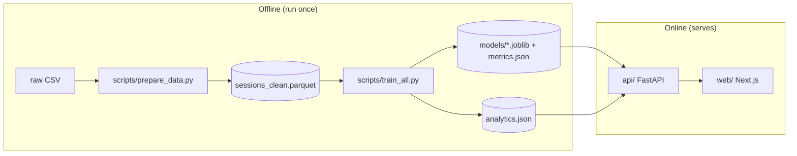
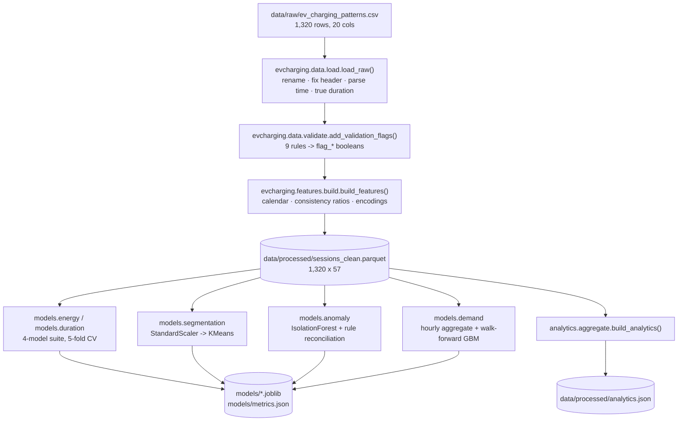
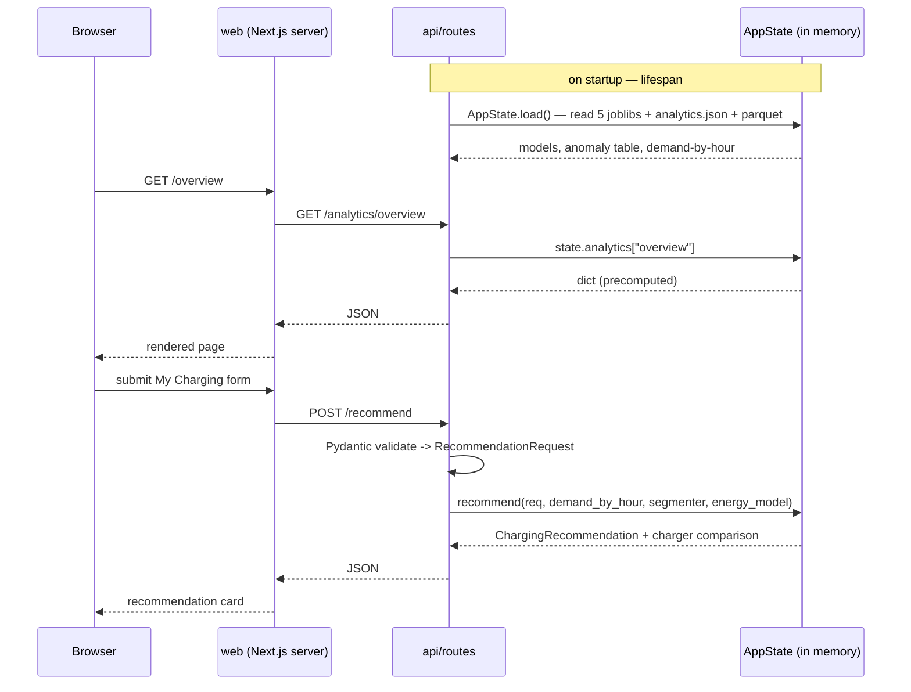

# Architecture

System design, data flow, data models, and module responsibilities. The condensed
version is in the [root README](../../README.md#6-architecture).

## Design principle: two decoupled halves

The system splits cleanly into an **offline** batch pipeline and an **online** serving
stack. They communicate only through files on disk — never a shared process or database.

Why: the notebooks, the training scripts, the API, and the CI can each change without
touching the others; and the serving path never runs pandas, so it starts fast and
stays predictable.

## Offline pipeline

### Module responsibilities

| Module | Input | Output | Notes |
| --- | --- | --- | --- |
| `data.load` | `ev_charging_patterns.csv` | typed DataFrame + `duration_hours` | fixes the Latin-1 `Temperature (°C)` header byte |
| `data.validate` | loaded DataFrame | 9 `flag_*` columns + `validation_report.json` | rules encode charging physics + plausible ranges; nothing is dropped |
| `features.build` | loaded DataFrame | `sessions_clean.parquet` columns | missing values kept as `NaN`; each model imputes its own subset |
| `models.regression` | parquet, target name | `RegressionReport` per model | shared by `energy` and `duration`; explicit K-fold loop |
| `models.segmentation` | parquet | pipeline + archetype names | `k` chosen by elbow + silhouette; falls back to `k = 4` when silhouette is flat |
| `models.anomaly` | parquet | pipeline + threshold + per-row reasons | reconciled against 5 "hard" rules (precision/recall) |
| `models.demand` | parquet | fitted GBM + hourly series | target is **energy per hour**, network-wide; walk-forward validation |
| `analytics.aggregate` | parquet (+ segmenter, anomaly scores) | `analytics.json` | 5 sections, shaped exactly as the dashboard renders |
| `recommendation.strategy` | a `RecommendationRequest` | `ChargingRecommendation` | physics-first; ML output used only as a sanity band |

## Online stack

### API responsibilities

| Component | Responsibility |
| --- | --- |
| `api.app.create_app()` | CORS from `EVCHARGING_CORS_ORIGINS`; `ValueError → 422`; `ArtifactsMissing → 503`; registers the lifespan and the router. Boots even without artifacts. |
| `api.state.AppState` | Loads everything once. Derives: a per-session anomaly table (score, risk bucket, reason string) and a demand-by-hour Series for `best_charging_window`. |
| `api.routes` | 10 endpoints. Analytics routes return `analytics.json` sections verbatim. `/predict/*` build a `feature_row` and call the (mean-baseline) model. `/recommend` wires `recommendation.strategy`. `/forecast` calls `demand.forecast_horizon` recursively. |
| `web/lib/api.ts` | One `fetch` wrapper. `cache: "no-store"`. Throws `ApiError` on network failure or non-2xx; pages catch it and render an inline error card. |

### Data pages vs interactive pages

- **Data pages** (`overview`, `analytics`, `segments`) — dynamic Server Components
  (`export const dynamic = "force-dynamic"`), fetch on the server, no client JS for data.
- **Interactive pages** (`anomalies`, `forecast`, `my-charging`) — a Server Component
  fetches the initial payload and passes it to a Client Component that owns the
  sorting / charting / form state.

## Data models

### Raw session (`ev_charging_patterns.csv`)

Source: [Electric Vehicle Charging Patterns](https://www.kaggle.com/datasets/valakhorasani/electric-vehicle-charging-patterns)
(Kaggle, synthetic). 20 columns. Full dictionary and license note:
[`../../data/README.md`](../../data/README.md). The columns that matter for design:

- `User ID` unique per row → **session-level** analysis, not user-level.
- `Charging Start/End Time` form a perfect 55 × 24 hourly grid → forecast **energy per
  hour**, not session count.
- `Charging Station ID` — 462 values, ~2.8 sessions each → **no per-station model**.

### Processed session (`sessions_clean.parquet`, 57 columns)

| Group | Columns (examples) |
| --- | --- |
| Identifiers | `user_id`, `station_id`, `location`, `vehicle_model`, `user_type`, `charger_type` |
| Raw measurements (renamed) | `energy_kwh`, `charging_rate_kw`, `cost_usd`, `soc_start_pct`, `soc_end_pct`, `battery_capacity_kwh`, `distance_km`, `temperature_c`, `vehicle_age_years` |
| Timestamps + true duration | `start_time`, `end_time`, `duration_hours` (= `end − start`) |
| Calendar features | `hour`, `weekday`, `is_weekend`, `month`, `day_name` |
| Consistency features | `soc_delta_pct`, `power_consistency_ratio`, `soc_energy_consistency_ratio`, `duration_consistency_ratio`, `implied_power_kw`, `energy_per_km` |
| Encodings | `vehicle_model_*`, `location_*`, `user_type_*` (one-hot), `charger_type_code` (ordinal) |
| Validation flags | `flag_energy_exceeds_capacity`, `flag_soc_not_increasing`, … (9) + `flag_any` |

Missing values are **not imputed** here — each model drops rows on its own target and
imputes predictors on its own modelling subset.

### `analytics.json`

`{ generated_at, overview, patterns, locations, segments, anomalies }` — the exact
shapes `web/lib/types.ts` declares and the pages render.

## External dependencies at runtime

None. No third-party APIs, no external database. MLflow (optional, `--track` only)
writes to a local SQLite file.
